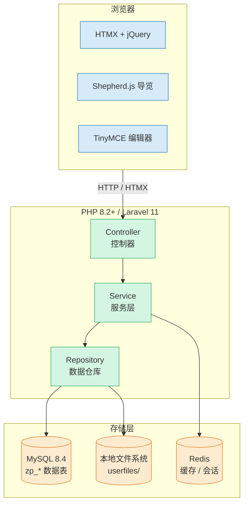

# 协界（CoBound）—— 高校课程项目协作管理平台

> **课程**: 软件需求分析 | **版本**: 1.0 | **日期**: 2026-06-11

## 项目简介

CoBound 是一款面向高校学生的课程项目协作管理平台，旨在解决大学生在小组作业、课程设计及竞赛项目中普遍存在的组队困难、沟通混乱、任务分配不明确以及进度缺乏监督等问题。

系统支持学生根据课程与兴趣进行组队，并提供任务分配、消息确认、Deadline 提醒、进度跟踪及风险预警等功能，帮助团队成员及时了解项目状态，提高协作效率。同时，系统还可为教师提供项目过程管理与成员贡献度参考，增强课程项目管理的透明度与规范性。

CoBound 基于开源项目 [Leantime 3.8.0](https://github.com/Leantime/leantime) 二次开发，保留上游架构、数据库结构和 API，对用户可见层进行品牌替换、简体中文本地化与新用户流程定制。

## 需求分析文档

| 文档 | 说明 |
|------|------|
| [软件需求规格说明书 (SRS)](docs/requirement/srs.md) | 完整的功能与非功能需求规格 |
| [用例模型](docs/requirement/use-cases.md) | 用例图、参与者描述与详细用例规约 |
| [用户故事](docs/requirement/user-stories.md) | 按角色组织的 32 个用户故事及验收标准 |
| [领域模型](docs/requirement/domain-model.md) | 核心实体、关系与数据表结构 |

## 核心功能

| 模块 | 功能 |
|------|------|
| 🔐 用户认证 | 邀请链接注册、五步中文引导、密码重置（联系管理员） |
| 📋 项目管理 | 创建课程项目、权限控制（公开/受限/指定成员）、仪表盘 |
| 📌 任务管理 | 看板视图（拖放）、列表视图、筛选与泳道分组 |
| 🎯 里程碑与目标 | 甘特图路线图、OKR 目标追踪、进度百分比 |
| ⏱ 工时记录 | 计时器、手动工时、工时表 |
| 📅 日历 | 个人日历、任务排期、iCal 订阅 |
| 💬 协作沟通 | 评论与回复、@提及、站内通知、文件管理 |
| 📚 知识管理 | Wiki 文档、SWOT / 精益画布 / 商业模式画布等分析工具 |
| 🆕 新手引导 | Shepherd.js 分步导览、默认示例项目 |
| 🌐 国际化 | 全量简体中文本地化，支持主题切换 |

## 主要定制改动

- 使用 CoBound 品牌与蓝青配色 Logo。
- 默认语言为简体中文，默认时区为 `Asia/Shanghai`。
- 补齐邀请注册、新手引导、默认项目和主要导览的中文内容。
- 新建用户时生成邀请链接，由管理员复制并发送，不依赖邮件服务。
- 忘记密码页面提示联系管理员；管理员仍可在用户管理中重置密码。
- 提供 Ubuntu 20.04 x86_64 的 Docker 离线部署方案。

## 用户角色

| 角色 | 权限 | 适用场景 |
|------|------|----------|
| Owner（所有者） | 系统全权限，不可删除 | 系统初始管理员 |
| Admin（管理员） | 管理用户、项目、系统设置 | 课程助教/系统管理员 |
| Manager（负责人） | 管理单项目、分配成员 | 课程教师/项目组长 |
| Editor（编辑者） | 创建/编辑任务、记录工时 | 普通学生成员 |
| Reader（只读） | 仅查看 | 旁听学生/外部评审 |

## 系统架构



## 开发环境

需要 Docker、Node.js、npm、PHP 8.2+ 和 Composer 2。

在仓库根目录执行：

```bash
make clean build
make run-dev
```

开发服务器启动后访问：

```text
http://localhost:5080
```

`make clean build` 会安装 Composer/npm 依赖并生成生产前端资源；`make run-dev` 会再次生成开发资源并启动开发容器。

详细说明见 [二次开发文档](docs/development.md)。

## 生产镜像

在 macOS 开发机的仓库根目录执行：

```bash
docker buildx build --platform linux/amd64 -t cobound:3.8.0-custom --load .
docker save cobound:3.8.0-custom | gzip > cobound-3.8.0-custom-amd64.tar.gz
```

生产环境默认访问地址为 `http://服务器IP:5180`，MySQL 不映射宿主机端口。完整步骤见 [Ubuntu 20.04 部署文档](docs/deployment-ubuntu-20.04.md)。

## 邀请与密码

1. 管理员在“用户管理”中创建用户。
2. 系统生成待激活账户和唯一邀请链接，并跳转至用户详情。
3. 管理员复制邀请链接，通过即时通信工具发送给用户。
4. 用户通过链接完成五步中文注册。
5. 用户忘记密码时联系管理员，由管理员在用户详情中重置。

底层 Mailer 和 SMTP 配置仍保留，以兼容既有扩展，但默认部署不开启 SMTP，界面也不展示邮件邀请入口。

## 常见问题

- **端口被占用**：开发环境检查 `5080`，生产环境检查 `5180`。
- **修改未生效**：先执行 `make clean build`，再重新启动容器。
- **邀请邮件未收到**：CoBound 默认不发送邀请邮件，请复制用户详情页中的邀请链接。
- **服务器无法联网构建**：在开发机生成 amd64 镜像压缩包，再传到服务器执行 `docker load`。

## 开源许可与来源

CoBound 基于 Leantime 3.8.0 开发，遵循仓库中的 [GNU AGPL v3 许可证](LICENSE)。项目保留上游 `CHANGELOG.md`、安全说明和治理文件原文。内部 `Leantime\...` PHP 命名空间、数据库表名及兼容标识未作修改。

## 项目文档结构

```text
docs/
  deployment-ubuntu-20.04.md    # Ubuntu 20.04 生产部署指南
  development.md                # 二次开发指南
  requirement/                  # 需求分析文档（软件需求分析课程）
    srs.md                      # 软件需求规格说明书
    use-cases.md                # 用例模型与详细规约
    user-stories.md             # 用户故事（32个）
    domain-model.md             # 领域模型与数据表结构
```
