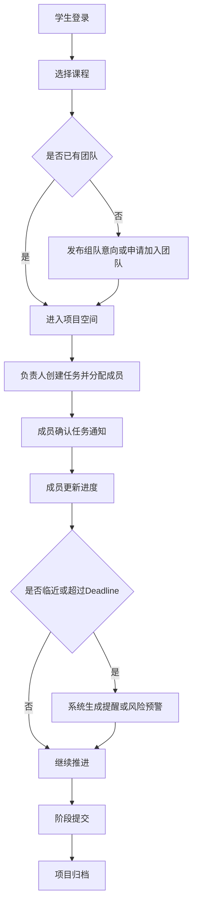
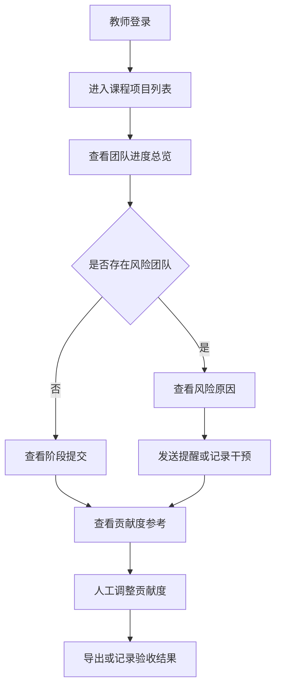

# 业务流程图

## 学生项目协作主流程

```mermaid
flowchart TD
    A[学生登录] --> B[选择课程]
    B --> C{是否已有团队}
    C -- 否 --> D[发布组队意向或申请加入团队]
    C -- 是 --> E[进入项目空间]
    D --> E
    E --> F[负责人创建任务并分配成员]
    F --> G[成员确认任务通知]
    G --> H[成员更新进度]
    H --> I{是否临近或超过Deadline}
    I -- 是 --> J[系统生成提醒或风险预警]
    I -- 否 --> K[继续推进]
    J --> K
    K --> L[阶段提交]
    L --> M[项目归档]
```

## 教师过程管理流程

```mermaid
flowchart TD
    A[教师登录] --> B[进入课程项目列表]
    B --> C[查看团队进度总览]
    C --> D{是否存在风险团队}
    D -- 是 --> E[查看风险原因]
    D -- 否 --> F[查看阶段提交]
    E --> G[发送提醒或记录干预]
    F --> H[查看贡献度参考]
    G --> H
    H --> I[人工调整贡献度]
    I --> J[导出或记录验收结果]
```

