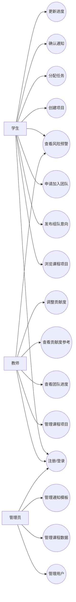

# 用例图

```mermaid
flowchart LR
    Student[学生]
    Teacher[教师]
    Admin[管理员]

    UC1((注册/登录))
    UC2((浏览课程项目))
    UC3((发布组队意向))
    UC4((申请加入团队))
    UC5((创建项目))
    UC6((分配任务))
    UC7((确认通知))
    UC8((更新进度))
    UC9((查看风险预警))
    UC10((管理课程项目))
    UC11((查看团队进度))
    UC12((查看贡献度参考))
    UC13((调整贡献度))
    UC14((管理用户))
    UC15((管理课程数据))
    UC16((管理通知模板))

    Student --> UC1
    Student --> UC2
    Student --> UC3
    Student --> UC4
    Student --> UC5
    Student --> UC6
    Student --> UC7
    Student --> UC8
    Student --> UC9

    Teacher --> UC1
    Teacher --> UC10
    Teacher --> UC11
    Teacher --> UC12
    Teacher --> UC13
    Teacher --> UC9

    Admin --> UC1
    Admin --> UC14
    Admin --> UC15
    Admin --> UC16
```

