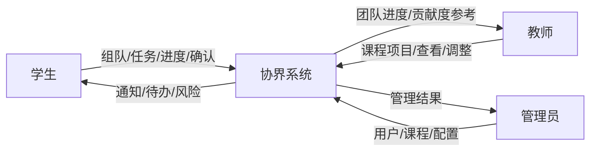
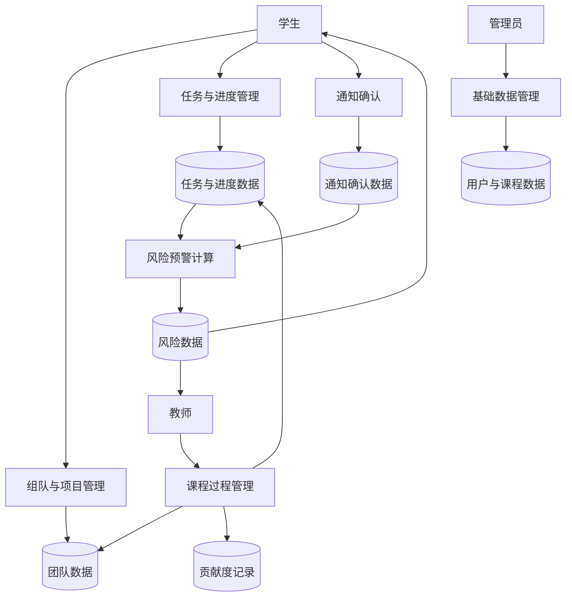

# 数据流图

## 0层数据流图

```mermaid
flowchart LR
    Student[学生] -->|组队/任务/进度/确认| System[协界系统]
    Teacher[教师] -->|课程项目/查看/调整| System
    Admin[管理员] -->|用户/课程/配置| System
    System -->|通知/待办/风险| Student
    System -->|团队进度/贡献度参考| Teacher
    System -->|管理结果| Admin
```

## 1层数据流图

```mermaid
flowchart TD
    Student[学生] --> P1[组队与项目管理]
    Student --> P2[任务与进度管理]
    Student --> P3[通知确认]
    Teacher[教师] --> P4[课程过程管理]
    Admin[管理员] --> P5[基础数据管理]

    P1 --> D1[(团队数据)]
    P2 --> D2[(任务与进度数据)]
    P3 --> D3[(通知确认数据)]
    P4 --> D1
    P4 --> D2
    P4 --> D4[(贡献度记录)]
    P5 --> D5[(用户与课程数据)]

    D2 --> P6[风险预警计算]
    D3 --> P6
    P6 --> D6[(风险数据)]
    D6 --> Student
    D6 --> Teacher
```

