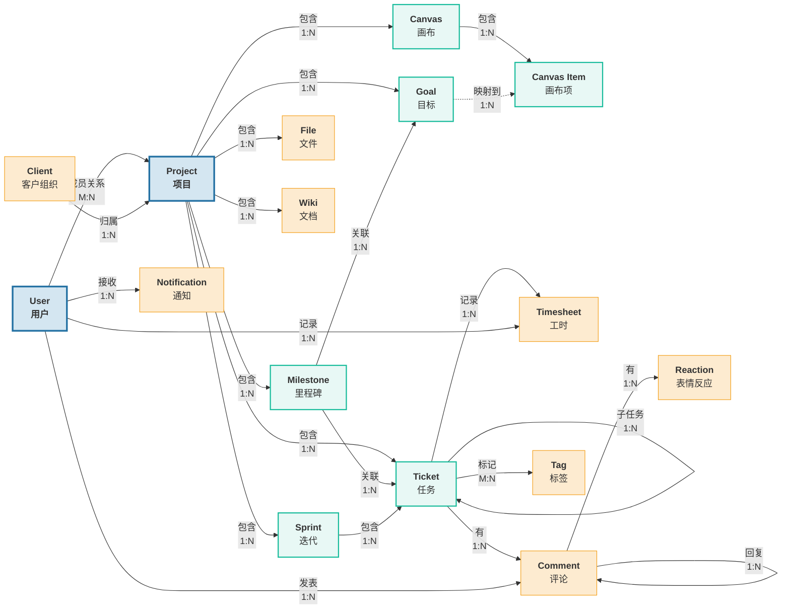
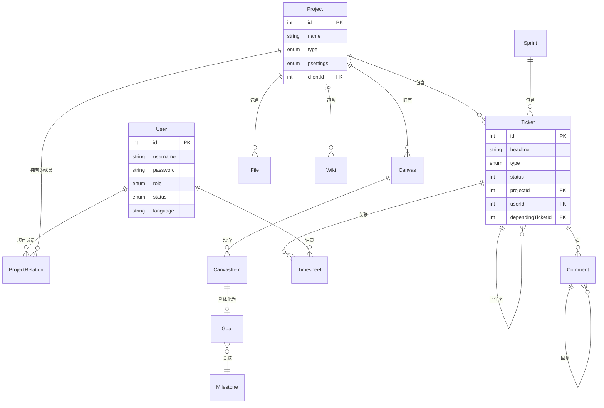

# 协界（CoBound）领域模型

> **版本**: 1.0 | **日期**: 2026-06-11 | **课程**: 软件需求分析

---

## 1. 核心领域概念图

> 实线箭头表示强关联关系，虚线箭头表示映射关系。标签标注了关系的多重性（1:1 / 1:N / M:N）。

### 1.2 核心实体关系（数据库视角）

---

## 2. 核心实体说明

### 2.1 User（用户）

| 属性 | 类型 | 说明 |
|------|------|------|
| id | int | 用户唯一标识 |
| username | string | 登录用户名 |
| password | string | bcrypt/Argon2 哈希密码 |
| firstname / lastname | string | 姓名 |
| role | enum | 系统角色：admin / manager / editor / reader |
| status | enum | 账户状态：active / invited / inactive |
| language | string | 语言偏好（默认 zh-CN） |
| timezone | string | 时区（默认 Asia/Shanghai） |
| profileImage | string | 头像文件路径 |

**关系**：
- 用户在项目中的成员关系通过 `project_relations` 中间表维护
- 一个用户可参与多个项目，在每个项目中拥有特定角色
- 一个用户可创建多条工时记录、评论和通知

**角色层级**：`owner > admin > manager > editor > commenter > reader`

- **owner**：系统所有者，不可删除
- **admin**：系统管理员
- **manager**：项目负责人，可管理项目内的成员和设置
- **editor**：项目成员，可创建/编辑任务
- **reader**：只读用户

### 2.2 Project（项目）

| 属性 | 类型 | 说明 |
|------|------|------|
| id | int | 项目唯一标识 |
| name | string | 项目名称 |
| details | text | 项目描述 |
| type | enum | 项目类型（project / strategy / program） |
| psettings | enum | 访问权限（public / client / restricted） |
| clientId | int (FK) | 归属客户 |
| hourBudget / dollarBudget | float | 工时/金额预算 |
| state | int | 项目状态 |

**生命周期**：创建 → 活跃 → 归档/删除

**关系**：
- 包含多条 Ticket、Milestone、Goal、File、Wiki
- 拥有项目独有的 Canvas 画板集合
- 通过 `project_relations` 关联成员

### 2.3 Ticket（任务）

任务系统使用单一表 `zp_tickets` 承载三种实体：

| type 值 | 语义 |
|---------|------|
| `ticket` | 普通任务 |
| `subtask` | 子任务，通过 `dependingTicketId`/`parentTicket` 关联父任务 |
| `milestone` | 里程碑，通过 `dependingTicketId` 关联所属项目 |

| 属性 | 类型 | 说明 |
|------|------|------|
| id | int | 任务唯一标识 |
| headline | string | 任务标题 |
| description | text | 任务详情（支持富文本） |
| projectId | int (FK) | 所属项目 |
| type | enum | 类型（ticket / subtask / milestone） |
| status | int | 状态（对应项目自定义状态标签） |
| priority | int | 优先级 |
| storypoints | float | 故事点/工作量估算 |
| editorId | int (FK) | 编辑者 |
| userId | int (FK) | 负责人 |
| dateToFinish | datetime | 截止日期 |
| tags | string | 标签（#tag 格式） |
| dependingTicketId | int | 父任务/关联里程碑 ID |
| sprint | int | 所属迭代 |
| sortindex | int | 看板排序位置 |

**状态流转**：新建 → 进行中 → 待审核 → 完成（可自定义）

### 2.4 Goal（目标）

| 属性 | 类型 | 说明 |
|------|------|------|
| id | int | 目标唯一标识 |
| title | string | 目标描述（Objective） |
| description | string | 指标衡量方式（Metric） |
| canvasId | int (FK) | 所属目标画布 |
| milestoneId | int (FK) | 关联里程碑 |
| metricType | enum | 指标类型（percent / value / currency） |
| startValue / currentValue / endValue | float | 指标值（起始/当前/目标） |
| status | int | 目标状态 |

**进度计算**：`progress = (currentValue - startValue) / (endValue - startValue) * 100%`

### 2.5 Comment（评论）

| 属性 | 类型 | 说明 |
|------|------|------|
| id | int | 评论唯一标识 |
| module | string | 评论归属模块（ticket / project / canvas） |
| moduleId | int | 评论目标实体 ID |
| text | text | 评论内容（支持 @mention） |
| userId | int (FK) | 评论者 |
| parent | int | 父评论（用于回复串） |

### 2.6 Timesheet（工时记录）

| 属性 | 类型 | 说明 |
|------|------|------|
| id | int | 记录唯一标识 |
| userId | int (FK) | 记录人 |
| ticketId | int (FK) | 关联任务 |
| projectId | int (FK) | 关联项目 |
| hours | float | 工时数 |
| kind | string | 工作类别 |
| workDate | date | 工作日期 |
| invoicedEmpl / invoicedComp | bool | 开票状态 |

### 2.7 File（文件）

| 属性 | 类型 | 说明 |
|------|------|------|
| id | int | 文件唯一标识 |
| module | string | 归属模块 |
| moduleId | int | 归属实体 ID |
| projectId | int (FK) | 所属项目 |
| userId | int (FK) | 上传者 |
| encName / realName | string | 存储路径/原始文件名 |
| extension | string | 文件扩展名 |
| date | datetime | 上传时间 |

---

## 3. 实体关系摘要

| 关系 | 类型 | 说明 |
|------|------|------|
| User → Project | M:N | 通过 project_relations 中间表，携带项目内角色 |
| Project → Ticket | 1:N | 一个项目包含多条任务 |
| Ticket → Ticket | 1:N | 父任务可有多个子任务；里程碑关联多条任务 |
| Project → Goal | 1:N | 一个项目包含多个目标（通过 Canvas 组织） |
| Goal → Milestone | M:1 | 多个目标可关联同一个里程碑 |
| Ticket → Comment | 1:N | 一条任务可有多条评论 |
| Comment → Comment | 1:N | 评论可有多个回复 |
| Ticket → Timesheet | 1:N | 一条任务可有多条工时记录 |
| Project → File | 1:N | 一个项目包含多个文件 |
| Project → Wiki | 1:N | 一个项目可有多个 Wiki 空间 |
| Project → Canvas | 1:N | 一个项目可有多个分析画布 |
| Sprint → Ticket | 1:N | 一个迭代包含多条任务 |
| User → Notification | 1:N | 一个用户接收多条通知 |

---

## 4. 核心数据表结构

| 表名 | 对应实体 | 关键字段 |
|------|---------|----------|
| zp_user | User | username, password, role, status |
| zp_projects | Project | name, type, psettings, clientId |
| zp_tickets | Ticket / Milestone | headline, type, status, projectId, dependingTicketId |
| zp_canvas | Canvas Board | title, type, projectId |
| zp_canvas_items | Goal / Canvas Item | title, box, canvasId, milestoneId, metricType |
| zp_timesheets | Timesheet | userId, ticketId, hours, workDate |
| zp_comments | Comment | module, moduleId, text, parent |
| zp_files | File | module, moduleId, encName, extension |
| zp_relationuserproject | User-Project 关系 | userId, projectId, projectRole |

注：表均使用 `zp_` 前缀，符合上游 Leantime 命名约定。
