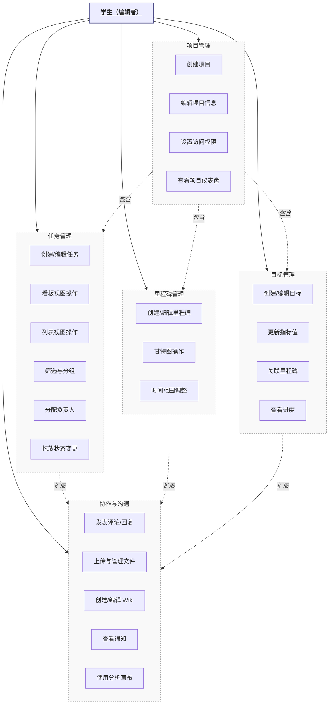

# 协界（CoBound）用例模型

> **版本**: 1.0 | **日期**: 2026-06-11 | **课程**: 软件需求分析

---

## 1. 用例图

### 1.1 系统顶层用例图

```mermaid
graph TB
    subgraph CoBound["<b>CoBound 协界</b>"]
        subgraph UC_AUTH["注册与认证"]
            UC1["通过邀请链接注册"]
            UC2["登录 / 登出"]
            UC3["密码管理"]
        end
        subgraph UC_WORK["个人工作台"]
            UC4["查看我的任务"]
            UC5["工时记录"]
            UC6["日历管理"]
        end
        subgraph UC_COLLAB["项目协作"]
            UC7["项目管理"]
            UC8["任务管理"]
            UC9["里程碑 / 目标"]
            UC10["文件 / Wiki"]
            UC11["评论 / 通知"]
        end
        subgraph UC_SUPERVISE["项目监督与评估"]
            UC12["创建项目 / 邀请成员"]
            UC13["查看成员贡献"]
            UC14["项目过程审查"]
        end
        subgraph UC_ADMIN["系统管理"]
            UC15["用户管理"]
            UC16["系统设置"]
            UC17["角色权限管理"]
        end
    end

    ACTOR_INV["<U>未激活用户</U>"]:::actor --> UC1
    ACTOR_STU["<U>学生（编辑者）</U>"]:::actor --> UC4
    ACTOR_STU --> UC5
    ACTOR_STU --> UC6
    ACTOR_STU --> UC8
    ACTOR_STU --> UC9
    ACTOR_STU --> UC10
    ACTOR_STU --> UC11
    ACTOR_TEACHER["<U>教师 / 负责人</U>"]:::actor --> UC7
    ACTOR_TEACHER --> UC12
    ACTOR_TEACHER --> UC13
    ACTOR_TEACHER --> UC14
    ACTOR_ADMIN["<U>管理员</U>"]:::actor --> UC15
    ACTOR_ADMIN --> UC16
    ACTOR_ADMIN --> UC17

    classDef actor fill:#ececff,stroke:#404080,stroke-width:2px,font-weight:bold
    classDef boundary fill:#f9f9f9,stroke:#999,stroke-dasharray:3
    class UC_AUTH,UC_WORK,UC_COLLAB,UC_SUPERVISE,UC_ADMIN boundary
```

> 上图以参与者（Actor）关联用例的方式展示系统顶层功能划分。`<U>` 下划线标记的节点表示参与者角色。

### 1.2 项目协作子用例图

> 虚线箭头标注了用例间的 `<i>包含</i>`（include）与 `<i>扩展</i>`（extend）关系。

---

## 2. 参与者（Actor）描述

| 参与者 | 对应系统角色 | 职责描述 |
|--------|-------------|----------|
| 未激活用户 | — | 已通过邀请链接创建账户但尚未完成引导流程的用户 |
| 学生（编辑者） | editor | 项目协作的核心角色，可创建和编辑任务、记录工时、评论 |
| 学生（只读） | reader | 仅可查看项目内容，适用于只需了解进度的成员 |
| 教师/负责人 | manager/admin | 项目创建者或课程教师，负责项目整体规划与成员管理 |
| 系统管理员 | admin | 管理所有用户账户和系统设置 |

---

## 3. 详细用例规约

### UC-01: 通过邀请链接注册

| 项目 | 内容 |
|------|------|
| **用例编号** | UC-01 |
| **用例名称** | 通过邀请链接注册 |
| **参与者** | 未激活用户 |
| **前置条件** | 管理员已创建用户记录，系统已生成有效的邀请链接 |
| **后置条件** | 用户账户激活，系统自动创建默认项目，跳转至引导流程 |
| **基本事件流** | 1. 用户点击邀请链接，进入注册页 2. 系统验证令牌有效性 3. 用户设置密码和个人信息（步骤1：账户） 4. 用户选择界面主题（步骤2：主题） 5. 用户选择颜色方案和字体（步骤3：个性化） 6. 用户设置每日工作起止时间（步骤4：作息） 7. 系统显示完成页面（步骤5：完成） 8. 系统创建默认项目，包含示例里程碑、任务和目标 9. 跳转至个人工作台 |
| **备选事件流** | 2a. 令牌无效或已过期：显示错误提示，建议联系管理员 4a. 用户跳过主题选择：使用默认主题 |
| **异常事件流** | 2b. 令牌已使用：提示账户已激活，引导至登录页 7a. 创建默认项目失败：记录错误日志，仍允许进入工作台 |

### UC-02: 用户登录

| 项目 | 内容 |
|------|------|
| **用例编号** | UC-02 |
| **用例名称** | 用户登录 |
| **参与者** | 学生、教师、管理员 |
| **前置条件** | 用户账户已激活 |
| **后置条件** | 用户进入个人工作台 |
| **基本事件流** | 1. 用户访问系统 URL，自动跳转至登录页 2. 用户输入用户名和密码 3. 系统验证凭据 4. 验证通过，创建会话 5. 根据角色展示对应的默认视图 |
| **备选事件流** | 2a. 勾选"记住我"：系统保存长期会话 3a. 凭据错误：显示错误提示，允许重试（限速 20次/分钟） |
| **异常事件流** | 4a. 账户未激活：提示需通过邀请链接完成注册 |

### UC-03: 创建项目

| 项目 | 内容 |
|------|------|
| **用例编号** | UC-03 |
| **用例名称** | 创建课程项目 |
| **参与者** | 教师/负责人 |
| **前置条件** | 用户具有 admin 或 manager 角色权限 |
| **后置条件** | 新项目创建完成，包含默认里程碑、任务和目标画布 |
| **基本事件流** | 1. 用户进入"所有项目"页面 2. 点击"新建项目"按钮 3. 填写项目名称、描述 4. 选择访问权限（公开/客户端内/仅指定成员） 5. 分配初始团队成员 6. 系统创建项目及其默认结构 7. 跳转至新项目仪表盘 |
| **备选事件流** | 4a. 不选择权限：默认使用"仅指定成员" 5a. 暂不分配成员：项目创建后可在设置中添加 |

### UC-04: 任务管理（看板模式）

| 项目 | 内容 |
|------|------|
| **用例编号** | UC-04 |
| **用例名称** | 通过看板管理任务 |
| **参与者** | 学生（编辑者）、教师/负责人 |
| **前置条件** | 用户已登录，当前在某项目中 |
| **后置条件** | 任务状态更新，看板视图刷新 |
| **基本事件流** | 1. 用户进入项目看板页面 2. 系统以列形式展示不同状态的任务 3. 用户可通过以下方式操作：  a. 拖放卡片至另一列（改变状态）  b. 点击卡片查看/编辑详情  c. 点击"+"创建新任务  d. 使用筛选器过滤任务  e. 使用分组下拉创建泳道 4. 所有变更实时反映在看板上 |
| **备选事件流** | 3c. 快速添加任务：仅输入标题，其他属性使用默认值 |

### UC-05: 忘记密码（联系管理员）

| 项目 | 内容 |
|------|------|
| **用例编号** | UC-05 |
| **用例名称** | 忘记密码重置 |
| **参与者** | 学生（忘记密码）、管理员（执行重置） |
| **前置条件** | 用户拥有已激活的账户 |
| **后置条件** | 用户密码被重置，可使用新密码登录 |
| **基本事件流** | 1. 用户在登录页点击"忘记密码" 2. 系统显示提示："请联系管理员用户重置密码" 3. 用户联系管理员 4. 管理员进入用户管理 → 编辑用户 5. 管理员设置新密码并保存 6. 管理员将新密码告知用户 7. 用户使用新密码登录 |
| **备选事件流** | 3a. 管理员可直接在用户详情页重置，无需用户主动联系 |

### UC-06: 查看项目进度（教师视角）

| 项目 | 内容 |
|------|------|
| **用例编号** | UC-06 |
| **用例名称** | 查看学生项目进度 |
| **参与者** | 教师/负责人 |
| **前置条件** | 教师是项目的负责人或管理员 |
| **后置条件** | 无 |
| **基本事件流** | 1. 教师进入项目仪表盘 2. 系统展示：  a. 项目整体进度百分比  b. 里程碑完成情况  c. 任务状态分布  d. 团队成员的近期状态更新 3. 教师进入工时表查看各成员工时记录 4. 教师进入目标页面查看量化指标完成度 |
| **备选事件流** | 2a. 项目无数据：显示引导提示，建议创建里程碑和任务 |

### UC-07: 创建新用户与生成邀请链接

| 项目 | 内容 |
|------|------|
| **用例编号** | UC-07 |
| **用例名称** | 创建新用户与生成邀请链接 |
| **参与者** | 管理员 |
| **前置条件** | 用户具有 admin 权限 |
| **后置条件** | 新用户记录创建，邀请链接已生成 |
| **基本事件流** | 1. 管理员进入"用户管理"页面 2. 点击"添加用户" 3. 填写用户名、角色 4. 系统创建用户记录，生成唯一邀请令牌 5. 系统跳转至用户详情页 6. 页面显示可复制的邀请链接 7. 管理员复制链接，通过即时通信工具发送给受邀者 |
| **备选事件流** | 3a. 填写邮箱（可选）：系统保留该字段但不自动发送邮件 |

### UC-08: 在线引导学习

| 项目 | 内容 |
|------|------|
| **用例编号** | UC-08 |
| **用例名称** | 通过导览学习系统功能 |
| **参与者** | 学生、教师 |
| **前置条件** | 用户首次进入某功能页面 |
| **后置条件** | 导览完成标记持久化 |
| **基本事件流** | 1. 用户首次进入某页面（工作台/项目仪表盘/看板/里程碑/目标） 2. 系统弹出引导介绍弹窗 3. 用户选择"开始导览" 4. 系统以 Shepherd.js 分步引导，逐步介绍页面各区域 5. 每步有"下一步"/"回退"/"取消"按钮 6. 最后一步显示"恭喜"并撒花动画 7. 系统记录该导览已完成，之后不再弹出 |
| **备选事件流** | 3a. 选择"我先自行探索"：关闭弹窗 3b. 勾选"不再显示"：永久隐藏该页面引导 |

---

## 4. 用例与功能需求跟踪矩阵

| 用例编号 | 关联功能需求 |
|----------|-------------|
| UC-01 | FR-AUTH-01, FR-ONBRD-01 |
| UC-02 | FR-AUTH-02 |
| UC-03 | FR-PROJ-01, FR-PROJ-02 |
| UC-04 | FR-TASK-01 ~ FR-TASK-05 |
| UC-05 | FR-AUTH-03 |
| UC-06 | FR-PROJ-03, FR-MILE-02, FR-GOAL-02 |
| UC-07 | FR-USER-01 |
| UC-08 | FR-ONBRD-01, FR-ONBRD-02 |
